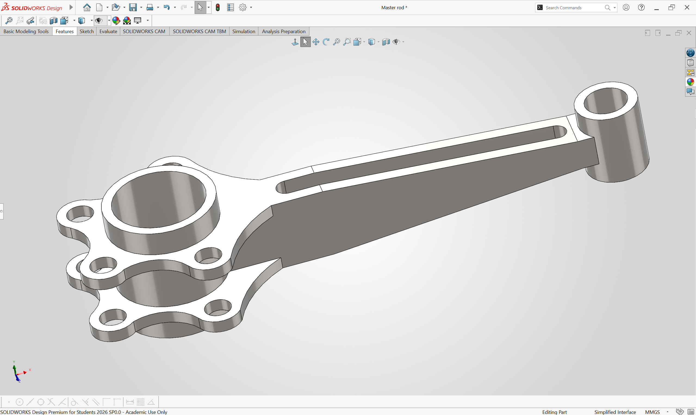
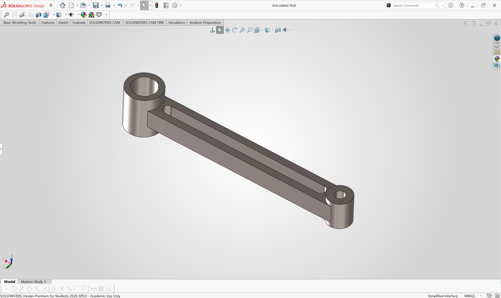
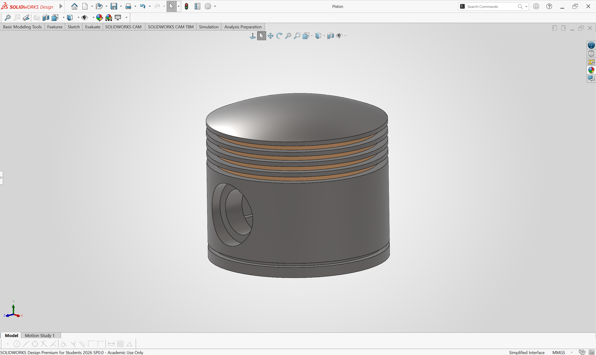
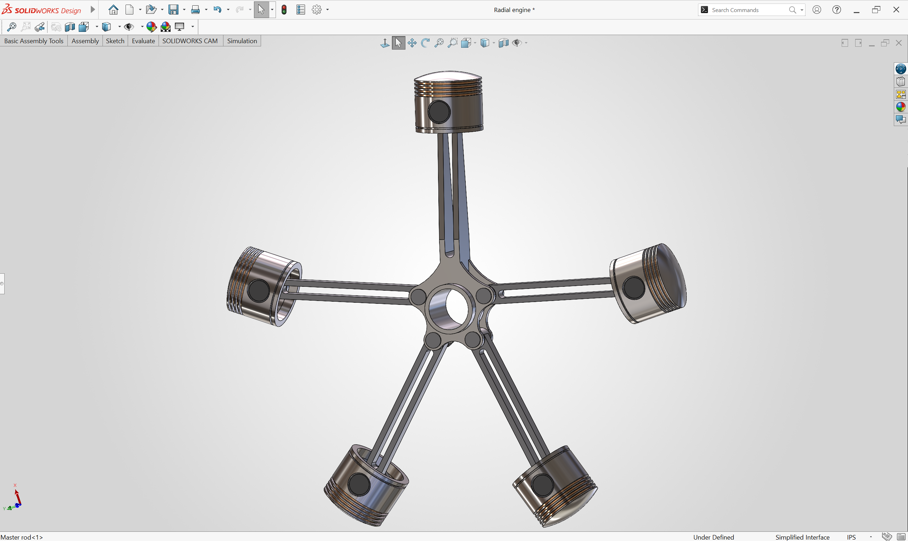
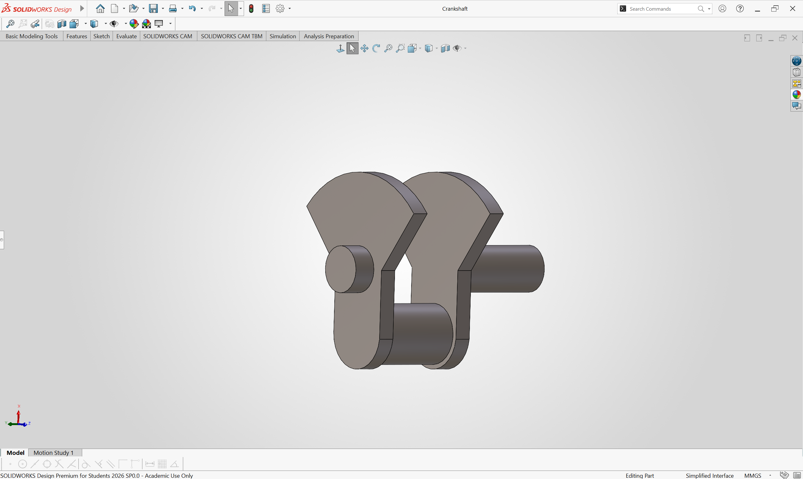
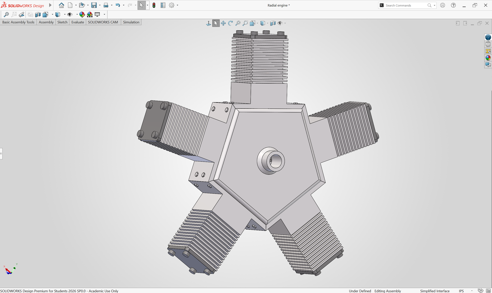
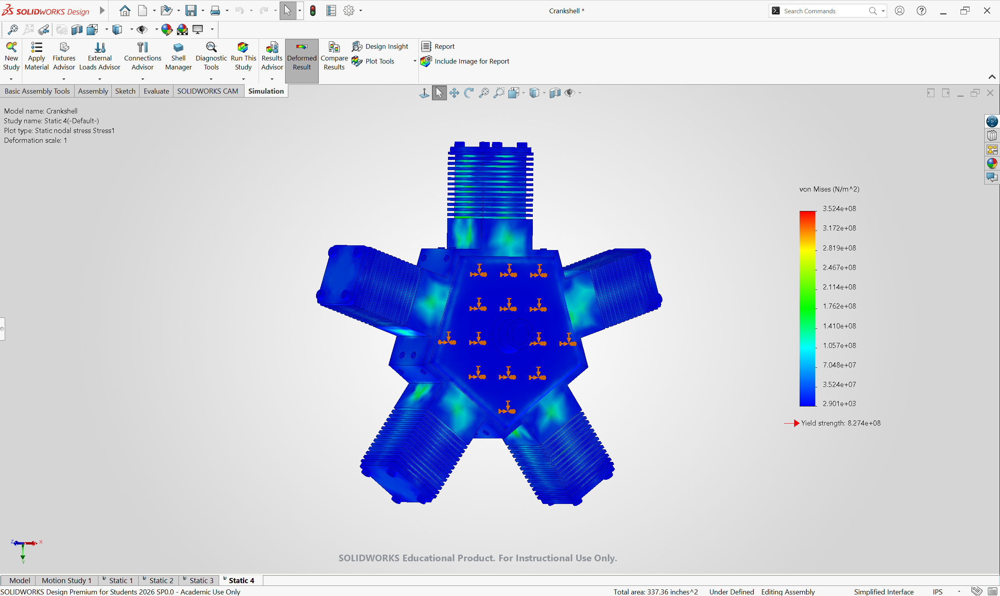

# Radial Engine CAD Assembly 
**Tools:** SolidWorks | **Timeline:** December 2025 – February 2026

## Overview
5-cylinder radial engine modeled to understand the mechanical timing
of a main and articulated rod system.

## Key Work
- Circular Component Patterns and top-down design for scalability
- Motion Study to animate and verify kinematics, resolving interferences via FEA
- Structured BOM with traceable part references for assembly documentation

## Images

### Key Components Modeled
- **Main Rod**: primary connecting rod linking the crankshaft to the master piston

- **Articulated Rod**: secondary rods connecting the remaining 4 pistons to the main rod

- **Piston**: top closure of each piston assembly, designed for precise fitment and clearance tolerances

- **Piston-Rod Subassembly**: isolated model of the piston joined to the main and articulated rods, showing the pin connections and joint geometry

- **Crankshaft**: precision-machined rotating shaft converting reciprocating piston motion into continuous rotational output, with offset crank pins timed to coordinate the firing sequence across all 5 cylinders

- **Engine Shell (Crankcase & Cylinder Barrels)**: 5 cylinder central structural housing enclosing the crankshafts, Main Rod, Articulated Rods, and the Pistons. 

- **Propeller**: 3-blade propeller modeled using SolidWorks Sweep to generate the twisted aerofoil profile along a defined pitch path, simulating rotational output from the crankshaft

### Full Assembly
> Crankcase rendered transparent to expose the internal Piston-Rod Subassembly and crankshaft geometry

### Bill of Materials
> Full structured BOM with part numbers, descriptions, and quantities for all 12 components in the assembly.

### Motion Studies

- **Piston-Rod Subassembly Motion** — isolated animation of the piston, main rod, and articulated rod cycling through one full crankshaft revolution, validating pin joint kinematics and interference clearances

- **Full Engine with Propeller** — complete 5-cylinder radial engine motion study with propeller attached, demonstrating synchronized firing sequence, rotational output, and propeller disc behavior under simulated load

## Finite Element Analysis (FEA) & Material Optimization

To validate the structural integrity of the engine block (Crankshell) under simulated combustion loads, 
a static nodal stress study was conducted in SolidWorks Simulation across four materials. Each study 
applies identical boundary conditions and loading to isolate material performance as the sole variable.

### Methodology
Von Mises stress criterion is used to evaluate yielding:

- **Von Mises Stress (σ_vm)** — equivalent stress combining all stress components into a single scalar value
- **Yield Strength (σ_y)** — the stress at which a material begins to permanently deform
- **Factor of Safety (FOS)** — ratio of yield strength to peak stress: `FOS = σ_y / σ_vm(max)`
- A **FOS > 1.0** means the part does not yield; **FOS < 1.0** means failure

---

### Static 1 — 1060-H12 Aluminum

| Parameter | Value |
|---|---|
| Peak Von Mises Stress | 633.5 MPa |
| Yield Strength | 75.0 MPa |
| Factor of Safety | **0.12** |

**Result: FAIL** — Peak stress is 8.4× the yield strength. The crankshell catastrophically yields 
under load. Commercially pure aluminum has no viable application in combustion engine structures. 
Serves as a baseline only.

---

### Static 2 — 6061-T6 Aluminum

| Parameter | Value |
|---|---|
| Peak Von Mises Stress | 644.2 MPa |
| Yield Strength | 275.0 MPa |
| Factor of Safety | **0.43** |

**Result: FAIL** — Peak stress is 2.3× the yield strength. Despite being a standard structural alloy 
used widely in aerospace and automotive applications, 6061-T6 is insufficient for the peak combustion 
loads in this engine configuration. Significant permanent deformation would occur.

---

### Static 3 — 7075-T6 Aluminum

| Parameter | Value |
|---|---|
| Peak Von Mises Stress | 348.7 MPa |
| Yield Strength | 505.0 MPa |
| Factor of Safety | **1.45** |

**Result: PASS ✓** — Peak stress remains below yield strength with a 45% structural buffer. 
The stress distribution is predominantly in the lower range (blue), with moderate stress 
concentrations at the cylinder collar interfaces (green). The part operates entirely within 
its elastic region — it deforms under load but returns to its original geometry. Selected as 
the optimal material for its high strength-to-weight ratio.

---

### Static 4 — Ti-6Al-4V Titanium

| Parameter | Value |
|---|---|
| Peak Von Mises Stress | 352.4 MPa |
| Yield Strength | 827.4 MPa |
| Factor of Safety | **2.35** |

**Result: PASS ✓** — Highest FOS of all four materials with a 135% structural buffer. Stress 
concentrations are minimal and well distributed. However, Ti-6Al-4V carries a significant cost 
and machinability penalty over aluminum — its superior performance is not required given that 
7075-T6 already satisfies the structural requirements. Retained as a high-performance fallback 
for elevated operating conditions.

---

### Material Comparison Summary

| Material | Peak Stress (MPa) | Yield Strength (MPa) | FOS | Result |
|---|---|---|---|---|
| 1060-H12 Aluminum | 633.5 | 75.0 | 0.12 | ❌ Fail |
| 6061-T6 Aluminum | 644.2 | 275.0 | 0.43 | ❌ Fail |
| 7075-T6 Aluminum | 348.7 | 505.0 | 1.45 | ✅ Pass |
| Ti-6Al-4V Titanium | 352.4 | 827.4 | 2.35 | ✅ Pass |

### Engineering Conclusion
7075-T6 Aluminum is selected as the optimal material. It is the lightest passing material, 
achieving a FOS of 1.45 while avoiding the cost and machinability challenges of titanium. 
The crankshell operates fully within its elastic region under peak combustion loads, confirming 
structural integrity without the weight penalty of a steel or titanium assembly.

---
